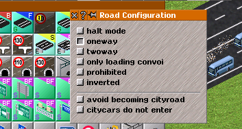
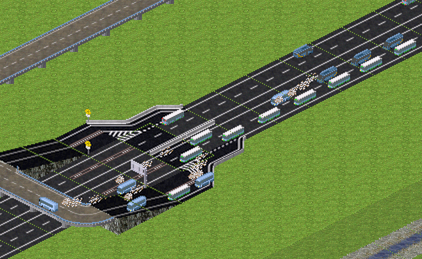
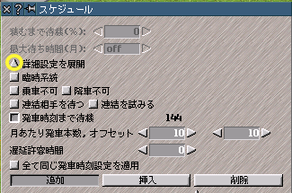
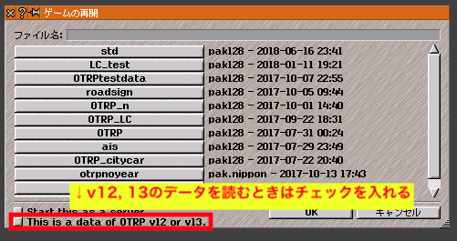

  
（ロゴ提供： [128な人](https://twitter.com/128na) ）  

[Document in English is here.](OTRP_information_en.md)  

# OTRPとは？
本家simutrans standardに機能をいくらか付け加えた改造版Simutransです．  
- 道路で片側二車線走行．往復4車線高速道路が作れるようになります．
- 道路に市道化防止・自家用車進入禁止を設定
- 範囲整地・建築ツールなど大規模開発に適したツール群
- 運行スケジュールの高度な設定．発車時刻の絶対時間指定や，乗降禁止等．
- 列車の増解結

といった機能が使えるようになります．
- 導入は簡単です．コンパイルなどは必要ありません．
- セーブデータはいつでもsimutrans standardの形式に戻せます．
- simutrans standardと全く同じように使えます．OTRPの機能を一つ一つ探検してみてください．

本家フォーラム: https://forum.simutrans.com/index.php?topic=16659.0  
Twitterハッシュタグ： [#OTRPatch](https://twitter.com/hashtag/OTRPatch?src=hash)

version27_1現在，simutrans standard nightly r9186をベースにしています．

# ダウンロード
実行には本体の他にribi-arrowアドオンが必要なので https://drive.google.com/open?id=0B_rSte9xAhLDanhta1ZsSVcwdzg からDLしてpakセットの中に突っ込んでください．  

本体は下のリンクからどうぞ．**（2020年9月25日AM0時　ver27_1に更新）**  
windows(GDI 64bit): https://osdn.net/projects/otrp/downloads/73628/sim-WinGDI64-OTRPv27_1.exe/  
windows(GDI 32bit): https://osdn.net/projects/otrp/downloads/73628/sim-WinGDI-OTRPv27_1.exe/  
mac: https://osdn.net/projects/otrp/downloads/73628/sim-mac-OTRPv27_1.zip/  
Linux: https://osdn.net/projects/otrp/downloads/73628/sim-linux-OTRPv27_1.zip/  
ソース: https://github.com/teamhimeh/simutrans/tree/OTRP-distribute  

OTRP専用のmakeobjはありません．simutrans standardのmakeobjをご利用ください．

# 導入方法
1. ribi-arrowをDLしてお使いのpakセットに入れる
2. pakフォルダの中にあるmenuconfでsimpletoolsの37番に適当なキーを割り当てる．例えばmenuconf.tabに`simple_tool[37]=,:`と追記すればコロンを押すとRibiArrowが出現する．
3. 本体をDLし，simutrans.exeが入ってる所と同じディレクトリに実行ファイルを入れる．
4. DLした実行ファイルを起動する．
standard版のsveファイルを上書きしないように気をつけましょう．

## mac・linuxユーザーの皆さまへ
OTRPの動作にはzstdというライブラリのインストールが必要です．  
macの場合：[homebrew](https://brew.sh/index_ja)をインストールの上，ターミナルで`brew install zstd`を実行してください．  
linuxの場合：[zstd](https://github.com/facebook/zstd)をソースからコンパイルの上，`make install`してください．バージョン1.4.4以上が必要です．

## ja.tabについて
https://github.com/teamhimeh/simutrans/blob/OTRP-distribute/documentation/ja.OTRP.tab にOTRP用ja.tabを置いておきました．ご自由にお使いください．

# 使い方
OTRPは使い方を知らなくてもstandardと同じように遊べるようになっています．少しずつ理解していきましょう．
## 道路の設定
  
道路アイコンを**Ctrlキーを押しながら**選択すると追い越しモード等を設定できます．
  
[追越モード]
- oneway: 道路を一方通行にして二車線同じ方向で通行するモードです．このモードの時は道路が一方通行になるので建設時は「:（コロン）」を押して接続方向を確認してください．
- halt mode: 停留所において追越車線でも客扱い・荷捌きをします．走行中の挙動はonewayと同じです．
- twoway: 本家standardの道路と同じ挙動をするモードです．対向車が来ないことが保証されるときのみ追い越しできます．
- only loading convoy: 停車中の車のみ追い越します．
- prohibited: 一切の追い越しが禁止されます．
- inverted: twowayモードの状態から車線が左右反転します．
-----
[その他]
- avoid becoming cityroad: 有効化すると道路は市道化しなくなります．（地面の道路にのみ有効）
- citycars do not enter: 自家用車の進入を禁止します．

### 道路確認ツール
「:（コロン）」キーを押すと，道路の接続方向が矢印で確認できます．（表示設定ウィンドウにあるボタンからも使用できます．）また，市道化防止や自家用車進入禁止が設定されている場合以下に従って色が変化します．
- 市道化防止が有効 → 緑
- 自家用車進入禁止が有効 → ピンク
- 市道化防止・自家用車進入禁止がともに有効 → オレンジ

## 車線誘導標識
交通量が増えてくるとこのように分岐部分で渋滞が発生することがあります．  
  
これは内側車線の車が車線をまたいで出口に進もうとして外側車線を塞いでしまうためです．一般道の複数車線信号つき交差点ではこの傾向がより顕著になります．  
OTRPでは標識を使うことで車がどちらの車線を使うか誘導することができます．oneway属性の道路上に一方通行標識を設置すると車線誘導標識になります．車線誘導は「intersection」で示されている座標（標識が設置されたところから次の交差点）まで有効です．  
  
「Left」を有効にすると次の交差点で左に進む車のみ左車線に誘導します．「Right」は右に進む車のみ右車線に誘導します．次の交差点がT字路のばあい，例えば左方向のみに分岐しているT字路であれば直進は右に進むという扱いになります．（なのでRightを有効にすると直進車が右車線に誘導されます．）  
車はこの標識を通過すると指示された車線に移ろうと**努力はします**が交通量が多すぎると車線移動に失敗することがあります．  
なおcitycarでは標識と交差点の距離がcitycar_max_look_forward未満の場合のみ有効です．（設定項目の章を参照）

## 道路信号
  
v13から道路信号の進入許可方向を設定できるようになりました．従来の信号を図のような4車線×2車線の交差点に二つ置くと交差点で車が右折できなくなるので，上図のように進入許可方向を設定してあげるといい感じに右折できるようになります．（例えば図の下側の信号は8ticksの間北・東・南方向への進入を許可し，16ticksの間東・南・西方向への進入を許可するという意味になります．）  
実際の接続方向は「接続方向」の数字で確認できます．この数字は北=1，東=2，南=4，西=8を足し合わせたもので，例えば北と東方向に開通していれば1+2=3と表示されます．  
デフォルトでは進入許可方向は南北-東西で設定されていますが，変更すると「南北：東西：オフセット」の文字列は意味を成していないので気になる方はja.tabの「Set phases」を書き換えてください．

## 車両描画位置の変更
pak128では鉄道車両の描画位置変更が行われた影響で，古い車両アドオンが新描画位置軌道から浮く現象が発生しています．  

  
713氏作　[Emu]JRK Limited Express Electric Cars "Intercity Kyushu" Set/ＪＲ九州　特急列車「インターシティ九州」セット　より

車庫画面で下図赤枠のボタンを押し，「set offset」と表示されるようにしてから車両を選択すると，その車種は4px下に描画されるようになります．これで，新描画位置軌道上に走らせても車両の位置が正しくなります．  
  

オフセットの設定は，pakxyz/config/reposition.tabに保存されます．reposition.tabはテキストファイルなので手で編集することもできます．  
なお，車庫画面でset offsetが出てくるのと，reposition.tabが保存されるのは128系のpakサイズでsimutransを起動したときのみです．reposition.tabの読み込みはその他のサイズのpakで起動したときも行われます．

## スケジュール設定
OTRPでは高度なスケジュール設定により，より柔軟な運行ができるようになっています．  
スケジュール画面で「詳細設定を展開」の三角形アイコンをクリックすると，詳細設定が出現します．詳細設定を閉じるには，もう一度三角形アイコンをクリックします．  
  

### 臨時系統/乗車・降車不可 等
- **臨時系統**：このスケジュールはRouteCostの計算に影響を与えなくなります．一時的な混雑解消用の直通路線の設定によって旅客の経由地を変更させたくない場合に便利です．
- **乗車不可(No Load)**：この停留所で乗車・積載が不可能になります．すなはち，降車専用になります．
- **降車不可(No Unload)**：この停留所で降車・荷降ろしが不可能になります．すなはち，乗車専用になります．
- **全員降車(Unload All)**：この停留所ですべての積載物を一度降ろします．すなはち，乗り換え扱いになります．

乗車不可・降車不可を両方有効にすると，乗車・降車ともにできなくなりますので，運転停車となります．

- **応荷重制御**：このスケジュールが登録された編成は，積載率に関わらず満載時の加速度で運転します．
- **最高速度**：このスケジュールにおける最高速度を指定できます．0は指定なしです．

### 増解結
本機能はInternational Forumで議論中の機能の先行実装です． [本家フォーラムのスレッドはこちら](https://forum.simutrans.com/index.php/topic,19064.0.html)

増解結の使い方は [こちらを参照](how_to_convoy_coupling.pdf) してください．

### 発車時刻指定
「発車時刻まで待機」を有効にすると，予めスケジュールされた時間に発車するようになります．発車時刻には，ゲーム画面左下部に表示されている時間軸が使用されます．  
  
この場合，一ヶ月が1440等分され，発車時間として使用されます．ゲーム内時間を使用しないのは，ゲーム内の月日表示は月によって一日の長さが異なるためです．一ヶ月を何等分するかは，高度な設定の「全般」タブにある **spacing_shift_divisor** で設定できます．デフォルトは1440です．

発車時間を指定するには，月あたりの **発車本数**，**オフセット**，**遅延許容時間** を設定します．月あたりの発車本数を**F**，オフセットを**D**とすると，1ヶ月を1440等分した時間軸で，(1440/**F**)×**n**+**D** (0≦**n**<**F**) の時間に発車します．例えば，月当たり発車本数を8，オフセットを20に設定すると，発車の間隔は1440/8=180となり，20, 200, 380, 560,...の時間に発車するようになります．

遅延許容時間を設定すると，正規の発車時刻から許容時間以内は発車が許可されます．例えば，遅延許容時間が30，正規の発車時刻の一つが100の場合は，列車が100+30=130までに発車できるのであればそのスロットでの発車が許可されます．

「全て同じ発車時刻設定を適用」を有効にすると，それを有効にして以降の発車本数，オフセット，遅延許容の設定がそのスケジュールの全エントリに適用されます．

## その他
- 運賃収受に伴う金額表示をON/OFFできるようになりました．表示設定ウィンドウから切り替えられるほか，simple_tool[38]にキーを割り当てることでも切り替えることができます．
- 交差点でのスムーズな通行を実現するため，交差点タイルでは車両がタイルを予約しています．予約状況は鉄道の閉塞予約解除ツール（bキー）を使うことで確認できます．タイルをクリックすることで予約を手動で解除することもできます．
- 駅/停留所の公共化ツールをshiftを押しながら使うと，現在有効なプレイヤー所属の停留所になります．ctrlキーを押しながら使うと，駅設備をもとのプレイヤー所有にしたまま公共化（公共駅だが建物を建設したプレイヤーが建物を撤去できる）できます．
- 建築物建設ツールで範囲選択ができるようになりました．選択された範囲に現在有効な建築物を配置します．（[shingoushori][1]氏による実装）なお，市内建築物に限り複数種類を選択することが可能です．
- 撤去ツールでも範囲選択が可能です．shiftキーを押すと選択された範囲の全オブジェクトを削除（立体的な選択も可能），shift+ctrlキーで選択された範囲から上の高度に対しても全オブジェクトを削除します．（[shingoushori][1]氏による実装）
- ctrlキーを押しながら土地上げ下げツールを使うと，選択された範囲が始点と同じ高度になります．（[shingoushori][1]氏による実装）
- ctrlキーを押しながらwayobj（架線）建設ツールを使うと，wayobjの設置間隔を設定できます．景観架線で架線柱を2マスごとに置く時などに便利です．
- ctrlキーを押しながら高架建設ツールを使うと，高架の高度オフセットを指定できます．1高度だけ地面から浮いた高架や，高高度の高架を建設するときに便利です．
- 起動時に出現するアドオン名重複警告はOTRPでは無効化されています．ただし，**-showoverlay** オプションをつけて起動したとき及びサーバーモードで起動したときはアドオン名重複警告が表示されます．
- longblocksignal（多閉塞信号）は検査した範囲をすべて予約するようになっています．すなはち，停車駅をこえて次の信号まで予約するようになっています．これは本家フォーラムで議論中の機能の先行実装です．
- 起動時に`-snapshot x,y,z,f`オプションで起動すると，スナップショットを撮影して終了します．x,y,zは中心座標，fはズーム率（0から9まで）です．異なるセーブファイルである固定地点のスクリーンショットを撮りたいときなどに便利です．
- 車庫画面で「置換編成に登録」を押すと，車庫に到着した編成の組成をその編成と同じにします．
- 路線ごとに駅間所要時間を表示できます．路線一覧ウィンドウから利用できます．時刻の単位は発車時間指定に使われているものです．

# 設定項目
主にsimuconf.tabや「高度な設定」で編集する項目です．  
ほとんどのパラメータはゲーム内に保存されます．
## citycarについて
（この章で説明するパラメータは全て高度な設定の「経路」タブにあります．）
- citycarは交差点ごとにランダムに進行方向を決めて進みます．**citycar_max_look_forward** はcitycarが何マス先まで予め経路を決めておくかを定義します．citycarが車線固定標識に従うには経路情報が必要なため，車線固定標識と対象交差点の距離がこのパラメータ以上だとcitycarは車線固定ができません．但しこの値を大きくすると交差点におけるルート選択のタイミングが早まるため交通状況がルート選択に反映されるタイミングが遅くなります．
- citycarはルート決定をする時交差点に遭遇すると，各方向に対して重み付けをして確率的に方向を決定します．この際，**citycar_route_weight_crowded**, **citycar_route_weight_vacant**, **citycar_route_weight_speed** のパラメータ（以下それぞれcr, va, spと表記）を使用します．
    - 単一タイル上でUターンをするのは他に選択肢がない時のみです．
    - Uターンをする（鋭角に曲がる）方向 → 重みは**1**になります．
    - 道路上に停車している車があるとき，重みは**cr**になります．デフォルト値はcr=20です．
    - 道路が空いているときの重みは**va + speed × sp** となります．speedは道路の制限速度です．デフォルト値はva=100, sp=0です．  
    例) cr=20, va=100, sp=1, 道路の制限速度が60km/hのとき，その道路上に車が存在していなければ選択の重みはva + speed × sp = 100 + 60 × 1 = 160 となります．
- citycarは渋滞などにより交差点手前で停車している時，一定間隔（1倍速で約2秒おき）でルートの再検索を行います．適切に設定されたパラメータのもとでは，これによりデッドロックを予防することができます．

## その他
- **stop_at_intersection_without_traffic_light**（経済タブにあります）のチェックを入れることで，車両が信号機ナシ交差点の手前で特定の条件に従って一時停止するようになります．デフォルトでは無効です．
- **advance_to_end**（ルートタブにあります）のチェックを外すことで列車のホームでの停車位置が実際に指定した位置になります．（デフォルトではstandardと同じく指定位置にかかわらず列車は先頭まで進みます．）なお指定した位置で編成がおさまらないときは編成全体がおさまるまで前進します．（extendedと同じです．）
- **routecost_halt**, **routecost_wait** （ルートタブにあります）を変更することで，旅客の乗り換え駅を制御することができます．routecost_haltは1駅ごとのルートコスト，routecost_waitは1回乗り換えするごとのルートコストです．デフォルト値はそれぞれ1と8です．

# データの互換性
## アドオンの互換性
OTRPはsimutrans standard向けのアドオンであれば全て使えます．OTRP専用アドオンというのは存在しません．
## セーブデータの互換性
- simutrans standardのデータは120.3を含めそのまま読み込めます．
- **OTRP v12,13系列のセーブデータを読み込むときは「This is a data of OTRP v12 or v13.」ボタンを押して読み込んでください．**（下図参照）  
  
v12,13を使っていた方で初めてv14を使うときは**autosave.sveを削除**してください．（古いバージョンのautosaveが残っていると起動時にそれを読んでクラッシュします．）
- extended版OTRPとの互換性はありません．
- 一度セーブデータを読み込んでそれを**保存した瞬間に**そのデータは**OTRP専用**になります．既存のデータをOTRPに移行する場合はバックアップを取った上で別ファイルとして保存することを強く推奨します．
- データセーブ時に「Readable by standard」ボタンを押して保存するとstandardで読み書きできる形式で保存されます．この形式では**OTRP固有の情報が失われる**ので注意してください．

# 使用状況の収集について
v24_4から皆さまの使用状況を収集させていただくこととしました．データは個人が特定できないもののみ収集し，統計的な使用状況解析に用います．

現時点での主な収集事項は以下のとおりです．
- 使用バージョン
- 言語設定
- OS
- 使用pak（名前だけ）
- ネットワークモードか
- 起動時間

# ライセンス
OTRPはSimutrans Standardからの派生物ですので，Standardのライセンスである[Artistic License](https://github.com/aburch/simutrans/blob/master/simutrans/license.txt) に従います．OTRPの再配布および改造したものの配布などについては以下の条件下で自由です．
- Artistic Licenseに違反しない条件下で配布してください．
- OTRPを不特定多数（NetSimutrans参加者に配布する等の用途は含まない）に再配布する際は，配布する場所をひめしにご一報ください． twitter: [@OTRPatch](https://twitter.com/OTRPatch)

# おねがい
バグ探しには皆さんのお力が必要です．バグと思われる挙動があればtwitter [@OTRPatch](https://twitter.com/OTRPatch) に報告していただけるとありがたいです．  
特に「ネットワークプレイ」が安定動作するかが確認取れてないので遊んでみて動作状況を教えていただけるとうれしいです．ぜひOTRPでNSを楽しんでみてください．

[1]:https://twitter.com/shingoushori
[2]:https://twitter.com/hypersimu
